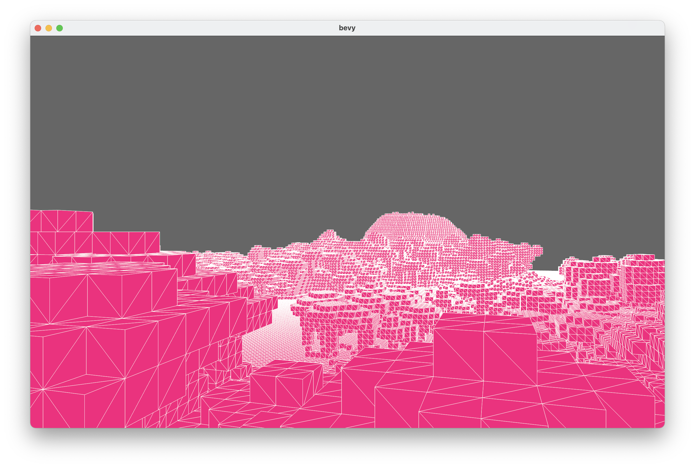

# Brine

Brine is my attempt at writing a Minecraft client in Rust using the [Bevy game
engine](https://bevyengine.org/). It's **EXTREMELY** work-in-progress.



The thing that makes Brine unique is that it is based on a high-level
abstraction of the Minecraft protocol that isn't specific to any one game
version[^1]. This is defined in the [`brine_proto`](crates/brine_proto) crate.

The goal for this API is to be generic enough to express the logic of the
Minecraft game for any version of the game, including (in theory) Bedrock
Edition. We'll see if that ends up being possible, I still have a lot to learn
about the differences in Minecraft versions.

I don't recall what exactly gave me the idea for the name "Brine." I think I was
thinking of Rust, then crustaceans, then the sea, and I landed on "Brine." I
only later realized that it was short for
[Herobrine](https://minecraft.fandom.com/wiki/Herobrine) :-).

## Docs

I take care to write good rustdocs for all my code. Generate and view them like
so:

```
cargo doc --workspace --no-deps --open
```

Or ditch the `--no-deps` if you want to be able to follow links to dependency
crates (this will generate docs for a *lot* of crates though).

Most crates also have a README. See [`crates/README.md`](crates/README.md) for a
good overview of the architecture of the whole project.

## Credits

### bevy

A huge thanks goes out to the wonderful community that is developing the Bevy
game engine.

### stevenarella

Mega shoutout to [@Thinkofname] and [@iceiix] for the hard work put into the
[steven] and [stevenarella] projects respectively. Having a reasonably robust
implementation of a couple dozen different Java Edition protocol versions
implemented from the get-go is amazingly helpful for bootstrapping this project.

[@Thinkofname]: https://github.com/thinkofname/
[@iceiix]: https://github.com/iceiix/
[steven]: https://github.com/thinkofname/steven
[stevenarella]: https://github.com/iceiix/stevenarella

### Minecraft data and assets

Thanks to [PrismarineJS] for maintaining the [`minecraft-data`] and
[`prismarine-chunk`] repositories.

Thanks to [@InventivetalentDev] for maintaining the [`minecraft-assets`]
repository.

Thanks to [@Trivernis] for [porting `minecraft-data` to Rust].

[PrismarineJS]: https://github.com/PrismarineJS
[`minecraft-data`]: https://github.com/PrismarineJS/minecraft-data
[`prismarine-chunk`]: https://github.com/PrismarineJS/prismarine-chunk

[@InventivetalentDev]: https://github.com/InventivetalentDev
[`minecraft-assets`]: https://github.com/InventivetalentDev/minecraft-assets

[@Trivernis]: https://github.com/Trivernis/
[porting `minecraft-data` to Rust]: https://github.com/Trivernis/minecraft-data-rs

### Building blocks

Thanks to [@bonsaiboro] for providing multiple useful crates related to voxel
game development, including [`block-mesh`].

[@bonsaiboro]: https://github.com/bonsaiboro/
[`block-mesh`]: https://github.com/bonsairobo/block-mesh-rs

[^1]: Being "protocol-generic" isn't new; see projects that came before like
[steven]/[stevenarella]. What is sort of new is the attempt to abstract the
logic of Minecraft into an API that greatly decouples the application logic from
the implementation details of the backend.

## License

This project is distributed under the terms of the MIT license.

Copyright Ben Reeves 2022
